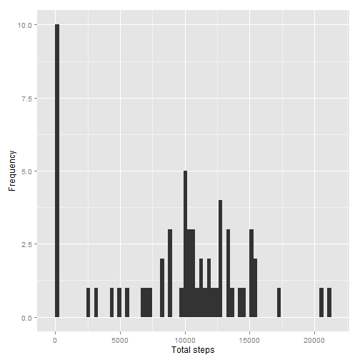
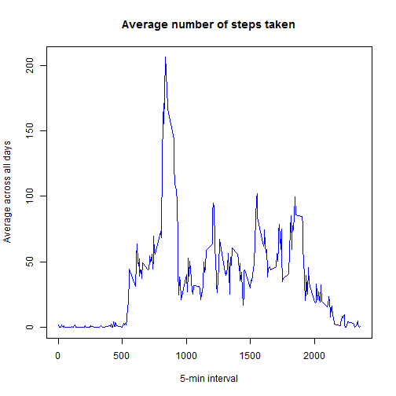
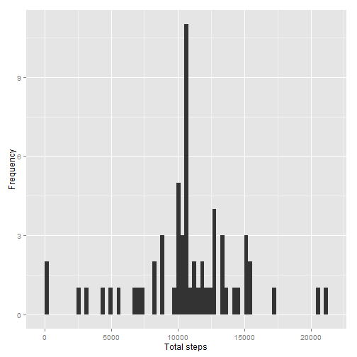
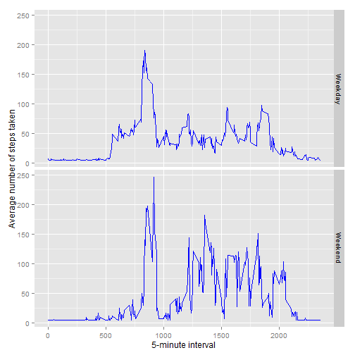

Title: "Reproducible Research: Peer Assessment 1"
=================================================
September 2015


## Loading and preprocessing the data
The working file is already in the working directory, unzip the working file.

```r
unzip("activity.zip")
dta <- read.csv("activity.csv", colClasses = c("numeric", "character", "numeric"))
dta$date <- as.Date(dta$date)
```
## What is mean total number of steps taken per day?
1. Calculate the total number of steps taken per day

```r
tsteps <- tapply(dta$steps, dta$date, sum, na.rm = TRUE) 
```
2. Make a histogram of the total number of steps taken each day

```r
library(ggplot2)
qplot(tsteps, geom = "histogram", binwidth = 300, xlab = "Total steps", ylab = "Frequency")
```

 

3. Calculate and report the mean and median of the total number of steps taken per day

```r
mean(tsteps)
```

```
## [1] 9354.23
```


```r
median(tsteps)
```

```
## [1] 10395
```
## What is the average daily activity pattern?
Make a time series plot (i.e. type = "l" ) of the 5-minute interval (x-axis) and the average number of steps taken, averaged across all days (y-axis)

```r
timess <- tapply(dta$steps, dta$interval, mean, na.rm = TRUE)   
plot(row.names(timess), timess, type = "l", main = "Average number of steps taken", 
     xlab = "5-min interval", ylab = "Average across all days", col = "blue")
```

 

Which 5-minute interval, on average across all the days in the dataset, contains the maximum number
of steps?

```r
maxstep_interval <- which.max(timess)
names(maxstep_interval)
```

```
## [1] "835"
```

## Imputing missing values
Calculate and report the total number of missing values in the dataset 
(i.e. the total number of rows with NA's)

```r
summary(dta$steps)
```

```
##    Min. 1st Qu.  Median    Mean 3rd Qu.    Max.    NA's 
##    0.00    0.00    0.00   37.38   12.00  806.00    2304
```
Create a new dataset that is equal to the original dataset but with the missing data filled in.
Devise a strategy for filling in all of the missing values in the dataset.

```r
suppressMessages(library(Hmisc))
```

```r
dtaImputed <- dta
dtaImputed$steps <- impute(dta$steps, fun=mean)
naa <- sum(is.na(dtaImputed)) 
```
*Number of line with NA after imputed = 0.*

Make a histogram of the total number of steps taken each day

```r
tstepsImp <- tapply(dtaImputed$steps, dtaImputed$date, sum)
qplot(tstepsImp, geom = "histogram", binwidth = 300, xlab = "Total steps", ylab = "Frequency")
```

 

Calculate and report the mean and median total number of steps taken per day.

```r
mean(tstepsImp)
```

```
## [1] 10766.19
```

```r
median(tstepsImp)
```

```
## [1] 10766.19
```
Do these values differ from the estimates from the first part of the assignment? 

Initial Mean and median

```r
mean(tsteps)
```

```
## [1] 9354.23
```

```r
median(tsteps)
```

```
## [1] 10395
```
Compared to imputed Mean and median using mean imputed strategy

```r
mean(tstepsImp)
```

```
## [1] 10766.19
```

```r
median(tstepsImp)
```

```
## [1] 10766.19
```
What is the impact of imputing missing data on the estimates of the total daily number of steps?  
*We see an increase in mean and median value. Mean and median value has the same value after imputation.*

## Are there differences in activity patterns between weekdays and weekends?
Create a new factor variable in the dataset with two levels - "weekday" and "weekend" indicating
whether a given date is a weekday or weekend day.

```r
day <- weekdays(dtaImputed$date) #single character vector of days
daytype <- vector()              #initialise an empty vector, to be filled up weekend/weekday
for (i in 1:nrow(dtaImputed)) {
    if (day[i] == "Saturday" | day[i] == "Saturday") {
        daytype[i] <- "Weekend" } 
    else {
        daytype[i] <- "Weekday" }
}
dtaImputed$daytype <- daytype
head(dtaImputed)
```

```
##     steps       date interval daytype
## 1 37.3826 2012-10-01        0 Weekday
## 2 37.3826 2012-10-01        5 Weekday
## 3 37.3826 2012-10-01       10 Weekday
## 4 37.3826 2012-10-01       15 Weekday
## 5 37.3826 2012-10-01       20 Weekday
## 6 37.3826 2012-10-01       25 Weekday
```
Make a panel plot containing a time series plot (i.e. type = "l" ) of the 5-minute interval (x-axis) and the average number of steps taken, averaged across all weekday days or weekend days (y-axis).

```r
dtaImputed$daytype <- factor(dtaImputed$daytype)
stepsByDay <- aggregate(steps ~ interval + daytype, data = dtaImputed, mean)
ggplot(stepsByDay, aes(interval, steps)) + 
    geom_line(color = "blue") + facet_grid(daytype ~ .) +
    xlab("5-minute interval") + ylab("Average number of steps taken")
```

 
